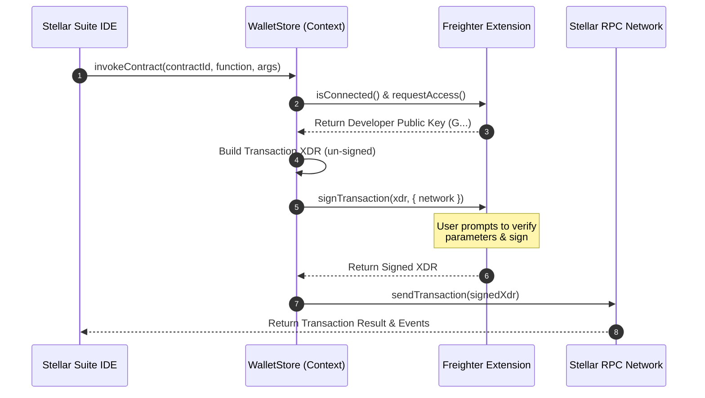
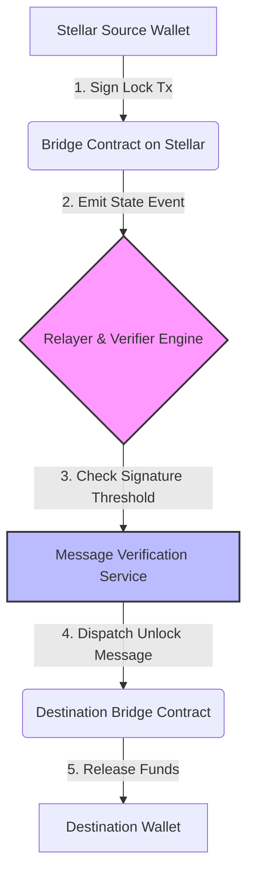
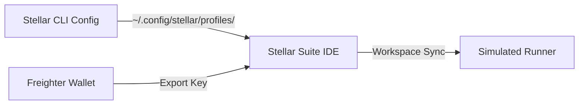
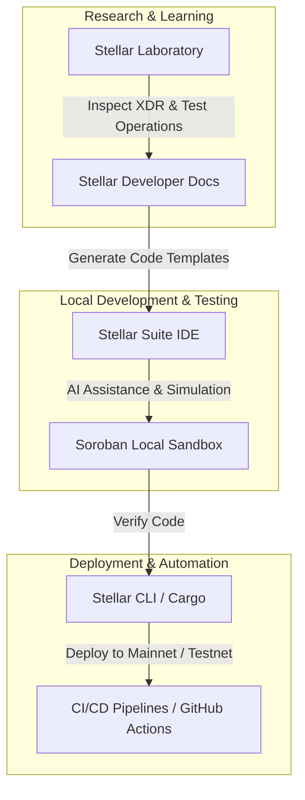

# Stellar Ecosystem Integration Guide

The Stellar Suite IDE is designed to be the cohesive control center for your Stellar and Soroban development lifecycle. This guide details how the IDE integrates seamlessly with wallets, the Stellar CLI, on-chain explorer tools, and private keys to create a unified developer workflow.

---

## 1. Wallet Integration (Freighter & Albedo)

The IDE interacts with browser wallets to let developers securely sign and submit transactions on Testnet, Mainnet, or custom local/enterprise networks.

### 1.1 Freighter vs. Albedo Workflows
- **Freighter Extension:** Uses the injected `window.stellarPubkey` and browser-extension IPC to request transaction signatures securely without exposing key material.
- **Albedo Signer:** Uses web-message communication protocols to prompt the user in a secure browser pop-up.

### 1.2 Interactive Transaction Signing Sequence
The flow of transaction signing within the IDE workspace:



---

## 2. Cross-Chain Asset Bridging (Bridge Wizard)

The **Bridge Wizard** in the IDE simulates and traces the multi-step lifecycle of bridging assets (e.g. USDC, Stellar native XLM) between Stellar/Soroban and external EVM or substrate chains.

### 2.1 The Bridge Workflow
The visual bridge wizard maps out each critical checkpoint:



### 2.2 Integration Details
During simulations:
- **Dry-Run Checkpoints:** The IDE tests bridge smart contract conditions (e.g., maximum limits, daily rate-limits, validation signatures) offline before submitting.
- **Dynamic Messaging Visualizer:** Translates raw event logs into interactive steps in the UI, highlighting exactly which step of the bridge flow a cross-chain message is in.

---

## 3. CLI State Sync & Local Environments

For developers working locally, the IDE automatically resolves configurations from the official `stellar-cli` environment.

### 3.1 Resolving Stellar CLI Identities & Networks
The IDE reads the configuration profiles generated by the CLI (usually located in `~/.config/stellar/` on macOS/Linux or `%APPDATA%\stellar` on Windows) to populate local network endpoints and developer keys.



### 3.2 Secret Sharing and State Sync Best Practices
To avoid exposing keys or manually copying contract identifiers across multiple CLI windows, the IDE synchronizes workspace states securely:
- **Shared Workspace file (`.vscode/settings.json`):** Tracks compiled contract wasm file locations and active contract IDs.
- **Local Key Storage Integration:** The IDE uses the system keychain via secure electron integrations where possible, rather than raw text files.
- **Excluded `.env` Configurations:** Secrets are parsed dynamically from local configurations without committing them to repositories.

**Recommended `.gitignore` configurations for team sync:**
```text
# Exclude keys, local RPC configurations, and build caches
.env
.env.*.local
.stellar/
.soroban/
target/
```

---

## 4. The Stellar Developer Journey Map

The IDE coordinates with existing tools to streamline transitions from learning to production operations:



---

## 5. Verified Multi-Tool Setup Verification

To verify that your local development environment is synced, you can execute the following terminal checks.

### 5.1 Checking CLI Configuration Paths
Verify that the `stellar-cli` is active and that network profiles are configured correctly:

```bash
# Check if stellar CLI is installed and show version
stellar --version
```
*Output:*
```text
stellar 22.0.1 (a1c2d3e 2026-05-10)
```

```bash
# List configured network profiles in stellar-cli
stellar network list
```
*Output:*
```text
testnet:
  rpc-url: "https://soroban-testnet.stellar.org:443"
  network-passphrase: "Test SDF Network ; September 2015"
local:
  rpc-url: "http://localhost:8000"
  network-passphrase: "Standalone Network ; Web Sandbox"
```

```bash
# Verify configured keys/identities in CLI
stellar keys list
```
*Output:*
```text
deployer-key (GCR...S2P)
test-alice (GD3...W5M)
```

### 5.2 Testing Workspace Config Sync
Ensure the IDE can access the builds by verifying contract targets are built:

```bash
# Verify compiled contract WASM targets are placed in target/
ls -lh target/wasm32-unknown-unknown/release/*.wasm
```
*Output:*
```text
-rwxr-xr-x  1 developer  staff   142K May 28 04:12 hello_world.wasm
-rwxr-xr-x  1 developer  staff   284K May 28 04:13 asset_bridge.wasm
```

---

*Need help setting up your dev chain? Check out the [Troubleshooting Guide](troubleshooting.md) or see our extension contributing doc.*
